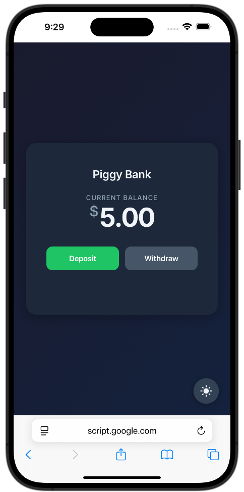

# Piggy Bank Savings Account

This Google Apps Script project turns a Google Sheet into a simple savings account ledger with interest calculations.



## Setup

There are two ways to set up this project: using `clasp` (recommended for developers) or manually copying the code.

### Option 1: Using `clasp` (Recommended)

This method uses the [Command Line Apps Script Projects (clasp)](https://github.com/google/clasp) tool to manage your project files.

1.  **Install `clasp`:** If you don't have it, install it globally:
    ```bash
    npm install -g @google/clasp
    ```
2.  **Log in to `clasp`:**
    ```bash
    clasp login
    ```
4.  **Create a new Google Sheet and Apps Script project:**
    ```bash
    clasp create --type sheets --title "Piggy Bank"
    ```
    This will create a new Google Sheet and Apps Script project and a `.clasp.json` file in your local directory.
5.  **Push the code:**
    ```bash
    clasp push -f
    ```
    This command will upload all the `.js` and `appsscript.json` files to your Apps Script project.
6.  **Run the setup function:**
    *   Open your Google Sheet and go to `Extensions > Apps Script`.
    *   In the Apps Script editor, open the file setup.gs and then select the `initApp` function from the dropdown and click "Run". This will create the "Ledger" and "Configuration" sheets and set up the weekly trigger to add interest.
7.  **Deploy the web app:**
    *   In the Apps Script editor, click the "Deploy" button in the top right.
    *   Select "New deployment".
    *   For "Select type", choose "Web app".
    *   Give your deployment a description.
    *   For "Who has access", choose "Only myself".
    *   Click "Deploy".
    *   Authorize the script when prompted.
    *   Copy the "Web app" URL. You will use this to access your piggy bank.

### Option 2: Manual Setup

1.  **Create a new Google Sheet:** Go to [sheets.new](https://sheets.new).
2.  **Open the Apps Script editor:** In your new sheet, go to `Extensions > Apps Script`.
3.  **Copy the code:**
    *   Copy the content of `appsscript.json` from this project and paste it into the `appsscript.json` file in the Apps Script editor.
    *   Create a new script file for each `.js` file in this project (`banking.js`, `setup.js`, `web.js`, `init.js`).
    *   Copy the code from each `.js` file in this project into the corresponding file in the Apps Script editor.
4.  **Run the setup functions:**
    *   In the Apps Script editor, select the `initSheets` function from the dropdown and click "Run". This will create the "Ledger" and "Configuration" sheets.
    *   Select the `setupTriggers` function from the dropdown and click "Run". This will set up the weekly trigger to add interest.
5.  **Deploy the web app:**
    *   Click the "Deploy" button in the top right.
    *   Select "New deployment".
    *   For "Select type", choose "Web app".
    *   Give your deployment a description.
    *   For "Who has access", choose "Only myself".
    *   Click "Deploy".
    *   Authorize the script when prompted.
    *   Copy the "Web app" URL. You will use this to access your piggy bank.

## Usage

Once set up, you can use the web app URL to add deposits and withdrawals to your ledger. The sheet will automatically calculate and add interest every week. You can customize the APY and other settings in the "Configuration" sheet.
